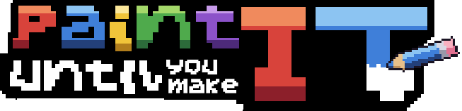

# Paint It Until You Make It



*(Anciennement « Vowel ». Logo : `docs/logo.png`, régénéré par `python docs/logo.py` à partir du logo d'origine relevé case par case dans `docs/logo_base.txt` (`#` plaque noire, `o` lettres) ; le I de « IT » y devient un crayon.)*

Police de l'écran titre (tous ses textes) : **Yoster Island** (codeman38, incluse dans un jeu même payant : `assets/fonts/YosterIsland-licence.txt`), complétée par `docs/yoster_glyphs.py` (parenthèses, /, %, ·, ◆, ●, →, ×, —, ’ dessinés dans son style), via `UI.use_menu_font()`. Le reste du jeu garde la police pixel d'origine.

Roguelike à vagues façon Brotato où **tu dessines tout** : ton perso, tes armes, tes balles, tes amulettes, et même les ennemis et les boss.
Godot 4.7, GDScript, pixel art 16 bits, 640×360 affiché en ×2.

## Lancer

1. Ouvre Godot 4.7, puis **Importer** et choisis `project.godot`.
2. Appuie sur **F5**.

Commandes : **ZQSD** / WASD / flèches / stick gauche pour bouger. Les armes attaquent toutes seules. **Échap** met en pause.
Pour dessiner : clic gauche pour peindre et clic droit pour gommer. Raccourcis B, E, L, R, O, F (outils), M (symétrie), G (dégradé), Ctrl+Z.

### Raccourcis clavier

| Écran | Touches |
|---|---|
| Partout | **Entrée** = valider / continuer, **Échap** = retour / fermer (rappelés dans l'infobulle des boutons) |
| En jeu | **Échap** ou **P** = pause · molette ou **+ / -** = zoom · dans la pause : **Entrée** reprendre, **O** options |
| Accueil | **Entrée** / **N** nouvelle partie, **A** atelier, **G** galerie, **B** codex, **O** options |
| Boutique | **R** actualiser la galerie, **A** ranger mes armes, **Entrée** salle suivante |
| Choix du dessin | **Entrée** utiliser, **M** modifier, **N** nouveau, **C** bord, **Échap** retour |
| Dessin | **B E L R O F S** outils, **M** symétrie, **G** dégradé, **C** bord, **V** aperçu, **Ctrl+Z / Ctrl+Y**, **Entrée** valider |
| Pose / rangement | **R** tourner, **M** miroir, **Entrée** valider |
| Galerie | clic = voir le dessin en grand, **C** = bord oui / non ; **Suppr** supprimer (avec confirmation, **Échap** = garder) |
| Conseils | **Entrée**, **Espace** ou **Échap** = compris |

Test automatique (simule dessins, 9 vagues avec boss, boutique, menus) :
`Godot --headless --path . res://tests/selftest.tscn`
Armes spéciales et nouvelles amulettes : `Godot --headless --path . res://tests/specials.tscn`

## Outil de dev (Ctrl+P en pleine vague)

Panneau de test (jeu en pause) : stats du perso (−/+), invincibilité, soin, or, niveaux, tuer tout, finir la vague, **aller directement à une vague** (−/+ puis « Y aller », sans boutique) ; faire apparaître **n'importe quel ennemi ou boss devant soi** (élite ou non) ; donner n'importe quelle **arme** (toute rareté) ou **amulette**, ajouter ou retirer des **familiers**. Les dessins manquants sont pris dans le Codex, sinon remplacés par des formes provisoires.
**À retirer avant de publier le jeu** : `ENABLED := false` dans `scripts/dev/dev_panel.gd` (ou supprimer le dossier `scripts/dev/`).

## Publier une version (GitHub)

Dépôt : https://github.com/Vltbcq/VowelGame. Lien à donner aux joueurs : https://github.com/Vltbcq/VowelGame/releases/latest

La pipeline `.github/workflows/release.yml` exporte le jeu sur les serveurs de GitHub (Godot 4.7.2, Windows), vérifie que tous les scripts compilent, puis publie une Release avec `Vowel.exe` et `Vowel-windows.zip` :
- à la main : onglet **Actions → Release → Run workflow**, choisir **contenu** ou **correctif** : le numéro est **calculé tout seul** depuis le dernier tag (contenu : v0.4 → v0.5 ; correctif : v0.4 → v0.4.1 → v0.4.2). Le champ « version précise » sert seulement pour forcer un numéro (ex. le jour du v1.0) ;
- ou en poussant un tag de version : `git tag v0.6` puis `git push origin v0.6`.
- Le résumé de la Release vient de `.github/release-notes/<version>.md` (à écrire avant ; sinon les derniers commits).

## Sauvegardes et reprise

- **3 sauvegardes** au lancement du jeu : chacune a sa progression (pigments, déblocages, records), sa galerie, son Codex et sa partie en cours. Les options sont communes. Bouton **Supprimer** avec confirmation (il faut cliquer, Entrée ne suffit pas). Depuis le titre : « Sauvegarde N · changer » (touche **S**).
- La sauvegarde 1 utilise les fichiers d'origine (`user://vowel_save.json`, `gallery/`, `bestiary/`) ; les 2 et 3 sont dans `user://slot2/` et `user://slot3/`. Options : `user://settings.json`.
- **Reprise de partie** : la partie est enregistrée automatiquement au début de chaque vague, à la fin de chaque vague, après chaque niveau et à chaque action en boutique (`run_save.dat`). **Sauvegarder et quitter** est dans le menu pause et dans la boutique ; au titre, **Reprendre** (Entrée). Quitter en pleine vague (ou fermer le jeu) fait recommencer cette vague depuis son début, avec les PV du début de vague. Commencer une nouvelle partie remplace la partie en cours (après confirmation, sans compter de défaite).
- Test : `res://tests/savetest.tscn` (travaille dans un dossier temporaire, jamais dans les vraies sauvegardes).

## Déroulé d'une partie

1. Choix de la difficulté : Esquisse → Croquis → Aquarelle → Huile → Chef-d'œuvre (chacune se débloque en gagnant la précédente). En plus des PV / dégâts / nombre d'ennemis :
   - **Croquis** : les élites arrivent.
   - **Aquarelle** : ennemis 10 % plus rapides ; les tireurs (Crachoir, Scinde, Éclaboussure, Craie) **visent là où tu vas**.
   - **Huile** : chaque élite a un **pouvoir** (aura colorée + nom à l'apparition) : Bouclier (ignore le 1er coup), Rapide (+30 %), Vampire (se soigne ×4 en te touchant), Explosive (explose peu après sa mort), Invocatrice (appelle 2 petits toutes les 5 s). Les ennemis tués laissent une **petite flaque qui ralentit** 3 s.
   - **Chef-d'œuvre** : sous 25 % de PV, les boss entrent en **FUREUR** (attaques 35 % plus rapprochées, +1/3 de projectiles dans leurs salves en cercle).
2. **Dessin du perso**, avec une encre limitée.
3. Choix de la première arme parmi 10 types (5 mêlée, 5 distance), puis dessin de l'arme (et de ses balles si c'est une arme à distance). Tu la **poses où tu veux** sur ton perso.
   - Chaque type d'arme et chaque amulette ne se dessine **qu'une fois par partie** : les exemplaires suivants réutilisent ce dessin.
   - Mêlée : Dague (rapide), Épée (arc), Lance (estoc long), Marteau (onde de choc en zone). La Faux (grand fauchage en spirale) n'existe qu'en épique ou légendaire.
   - Distance : Pistolet, Tromblon (éventail ×3), Arc (perforant), Baguette (tête chercheuse), Mortier (obus explosifs).
   - **Armes à ratio** (toutes raretés, en boutique seulement) : leurs dégâts suivent une stat. Plume solitaire (+60 % par emplacement d'arme libre), Rouleau à peinture (+15 % des PV max en dégâts), Chevalet-bouclier (+1,5 dégât par point d'armure), Aérographe (+1 % par % de vitesse), Cutter (critiques ×(2 + critique ÷ 35)), Compte-gouttes (+0,25 dégât par point de chance, plus d'effets élémentaires), Pinceau doré (+1 dégât par 12 or en poche), Règle graduée (+1,5 % par % de portée), Nuancier (+35 % par couleur sur ton perso), Silhouette (dégâts selon les pixels de ton perso, ×0,5 à ×3,5), Pipette (vol de vie ×3 sur ses coups, +5 % de base ; au-delà de 100 %, plusieurs PV par coup). La boutique affiche la valeur actuelle du ratio, et la taille de ton perso (pixels, couleurs) sous l'autoportrait.
   - **Armes spéciales** (jamais au choix de départ, seulement en boutique) :
     - Épiques ou plus : **Pinceau** (balaie et laisse une traînée d'encre qui brûle les ennemis), **Compas** (tourne sans arrêt autour de toi), **Tampon** (imprime ton dessin ×2 au sol : seuls les ennemis sous l'encre sont touchés, ×1,5 dégâts).
     - Épiques ou plus (suite) : **Ciseaux** (exécute sous 25 % des PV), **Agrafeuse** (épingle 1 s ; deux ennemis agrafés à la suite sont reliés et se partagent 50 % des dégâts), **Loupe** (rayon continu, ×1 → ×4 en restant sur la cible), **Brumisateur** (cône qui mouille : −30 % de vitesse, +25 % de dégâts Foudre/Glace), **Avion en papier** (aller-retour qui transperce deux fois), **Crayon HB** (+3 % par coup donné dans la vague, jusqu'à +150 %), **Éventail** (repousse très fort, choc contre les bords).
     - Légendaires (suite) : **Retouche** (5 % des ennemis tués sont redessinés dans ton camp 10 s), **Miroir déformant** (toutes les 2 s, renvoie les tirs ennemis proches), **Encre de Chine** (marque ; un marqué qui meurt éclabousse et marque ses voisins, en chaîne), **Grande Signature** (toutes les 8 s, une signature géante traverse l'écran ; plus forte avec les ennemis tués dans la partie), **Point final** (point noir qui aspire puis implose).
     - Légendaires uniquement : **Gomme sacrée** (un long trait de gomme : 30 % de chances d'effacer net un ennemi, 15 % pour un élite, sinon 25 % de ses PV ; les boss perdent 3 % ; efface aussi l'encre ennemie au sol), **Palette vivante** (un orbe chercheur par couleur du dessin, avec son effet élémentaire garanti ; pas de balles à dessiner), **Autoportrait** (envoie un clone de ton perso qui court vers l'ennemi et explose ; pas de balles à dessiner).
   - Chaque type et chaque amulette a sa propre quantité d'encre (et ses balles aussi).
4. **15 vagues**, un **boss toutes les 5 vagues** (vague 5 : Le Raturé, vague 10 : Le Critique *ou* La Muse, vague 15 : La Toile Blanche). La difficulté est calée pour que la vague 15 soit aussi dure que l'ancienne vague 20. Un nouvel ennemi apparaît régulièrement et tu dois le dessiner la première fois que tu le croises. Même chose pour ses projectiles.
   - Les boss sont costauds : PV revus à la hausse (Raturé 2400, Critique 7000, Muse 5000, Toile Blanche 26000, avant les multiplicateurs de difficulté et de dessin), +30 % de dégâts et +12 % de vitesse. Avec un build typique du moment, un combat dure environ 25 s (vague 5), 30-40 s (vague 10) et 1 min (vague 15). Mesure : `res://tests/bosstime.tscn`.
   - Vague 5 : mini-boss *Le Raturé*
   - Vague 10 : boss *Le Critique*
   - Vague 15 : mini-boss *La Muse*
   - Vague 20 : boss final *La Toile Blanche*
5. **Les PV ne remontent pas entre les vagues.** Une fois sur deux, la boutique propose une potion (Fiole d'encre 30%, Grand flacon 70%, Élixir de sève : régénération ×4, au moins +8, pendant les 10 premières secondes de la vague suivante), ou plus rarement un **Pot d'encre** (+40 d'encre pour retoucher ton perso, puis tu replaces armes et amulettes). À part (35 % des boutiques, dès la 2e ; donc parfois en plus d'une potion), un **événement** au hasard (~7 % chacun ; une fois un événement joué, les relances de cette boutique n'en proposent plus) :
   - **Roulette** : mise ton or sur Rouge ou Noir (×2) ou Vert (×36, comme au casino), 37 cases dont 1 verte, une mise par roulette.
   - **Ticket à gratter** (8 or) : gratte les 3 cases à la souris ; 3 symboles pareils (1 chance sur 3) : pièces = +25 or, étoiles = +15 % dégâts à la vague suivante, diamants = une amulette rare gratuite.
   - **Vente aux enchères** : une arme ou amulette épique (10 % légendaire). Surenchéris (+5 / +10 / +20) contre un collectionneur qui a un plafond secret (70 à 140 % du prix), ou retire-toi.
   - **Le Restaurateur** : tu lui confies une amulette (pas légendaire) et tu paies (15 / 30 / 50 or selon sa rareté) : elle est remplacée par une amulette de la rareté au-dessus, au hasard.
   - **Le Mécène** : 2 contrats au choix, +40 or contre +15 % d'ennemis ou +50 or contre 8 élites, à la vague suivante.
6. Entre les vagues, la **boutique** propose des armes et des amulettes (à dessiner si c'est la première fois, puis à poser, avec rotation R et miroir M pour les amulettes), une relance et la vente d'armes. **Plus l'offre est rare, plus tu as d'encre pour la dessiner** (armes ×1 / ×1,2 / ×1,5 / ×2, soit au plus 10 / 12 / 15 / 20 % de la surface de la toile ; amulettes ×1 à ×2). Les ennemis lâchent de l'or avec parcimonie (l'XP, elle, ne baisse pas).
7. **Montée de niveau** : après la vague, pour chaque niveau gagné tu choisis 1 bonus parmi 3 (rareté tirée comme en boutique : plus tu avances et plus ton niveau est haut, plus le rare sort), puis tu dessines une petite **marque d'encre** (plus le bonus est rare, plus elle peut être grande : 10 à 34 d'encre) (tatouage, cicatrice...) que tu poses sur ton perso. Elle ne compte pas dans sa taille : il ne devient ni plus gros ni plus lent. Sa couleur donne un peu de résistance. Bouton « Passer » pour ne pas dessiner.
8. En fin de partie, tu gagnes des **pigments**. L'**Atelier** (mur de planches, établi et tableau en liège) :
   - **Établi (pigments)** : Encrier, Grande toile, Étal élargi, Relance offerte, Bourse.
   - **Succès (tableau en liège)** : chaque succès débloque une amélioration. Terminer la vague 3 → pack primaire ; vaincre le boss de la vague 5 → pack secondaire ; 500 ennemis effacés → gros pinceaux ; 15 dessins en galerie → ligne ; vague 8 → rectangle ; boss de la vague 10 → ellipse ; niveau 10 → symétrie ; une arme légendaire → dégradé ; une vague sans perdre de PV → encre pulsante ; gagner une partie → encre scintillante ; gagner en Aquarelle ou plus → encre arc-en-ciel. Un succès obtenu **pendant une partie** est marqué tout de suite (bandeau « débloqué à la fin de la partie », sablier ⌛ sur le tableau de l'Atelier), mais son amélioration n'arrive qu'**à la fin de la partie** : victoire, défaite, abandon, ou partie en cours remplacée par une nouvelle. Les récompenses en attente sont sauvegardées (rien n'est perdu si tu quittes le jeu). L'écran de fin fait le récapitulatif « Nouveautés débloquées ». Hors partie (ex. galerie remplie depuis le Codex), c'est immédiat. Les anciennes sauvegardes gardent ce qui était déjà débloqué.

**Encre = traits seulement** : seuls les pixels de contour (au bord du dessin) coûtent de l'encre ; remplir ou colorier l'intérieur d'une forme est gratuit. Chaque dessin peut avoir ou non un **contour noir** en jeu (bouton « Bord » ou touche C, avec aperçu).

**Prix** : tout coûte plus cher au fil des vagues (×1 en vague 1, ×4,7 en vague 20). Chaque relance coûte plus cher que la précédente (remis à zéro à chaque boutique), et le prix de base des relances monte avec les vagues. En boutique, un objet déjà dessiné montre son dessin ; sinon un « ? ».

**Sens des armes** : dessine le manche (ou la crosse) à gauche et la pointe (ou le canon) à droite ; un repère est affiché sur la toile. En combat, c'est toujours le côté droit du dessin d'origine qui vise l'ennemi et d'où partent les tirs. R (tourner) et M (miroir) au rangement ne changent que la **pose au repos**, qui passe en miroir quand le perso se retourne.

**Rareté** (boutique et bonus de niveau) : épique à partir de la vague 6 (6 %, puis +2 % par vague), légendaire seulement sur les 5 dernières vagues (3 %, puis +2 % par vague). Couleurs : commun gris, rare **bleu**, épique violet, légendaire or. La chance avance ces paliers de 2 vagues au plus. Les chances actuelles sont affichées dans l'infobulle de « Actualiser la galerie ». Mesure : `res://tests/raritytable.tscn`.

Pendant le dessin d'une arme, de ses balles ou d'une amulette, l'aperçu **« sur le perso »** (touche V) montre l'objet à côté de ton perso, à la même échelle. Les **boss** ont de grandes toiles et doivent utiliser **au moins 95 % de leur encre**.

Le pot de peinture (Remplir, touche F) est disponible dès le départ. En jeu, la caméra zoome ×1,5 par défaut : molette ou + / - pour régler (sauvegardé).

**Outil Sélection** (de base, touche **S**) : trace un rectangle autour d'une zone, glisse-la pour la **déplacer**, **Suppr** pour l'**effacer** (l'encre revient), clic à côté ou clic droit pour la poser ; Ctrl+Z annule.

**Journal de partie** : tout ce que tu fais est noté (achats, fusions, reventes, bonus de niveau, événements, vagues) avec les stats au début de la dernière vague et la difficulté. « Reprendre » ouvre d'abord un écran avec ton perso, ses armes et amulettes, ses stats et le journal (Reprendre / Retour) ; l'écran de fin a un bouton **Journal** (J). Le journal est aussi écrit en texte dans le dossier de la sauvegarde (`journal_derniere_partie.txt`), écrasé à chaque nouvelle partie.

**Lisibilité** : les tirs ennemis ont un contour qui clignote blanc / rouge ; le butin des ennemis file tout de suite vers toi (plus besoin d'attendre la fin de la vague).

Chaque dessin validé va dans la **Galerie** et se réutilise dans les parties suivantes. La galerie s'ouvre sur l'onglet **Tout** (ou par catégorie) ; clique un dessin pour le voir en grand. Les nouveaux dessins sont **sans bord** par défaut (bouton « Bord » pour l'ajouter).

**Pourboire** (stat) : or gagné automatiquement à chaque fin de vague (amulettes Pièce, Trèfle et Tirelire, bonus de niveau).

## Effets (« juice »)

Fin de vague : toutes les gouttes restées au sol s'envolent vers le perso (les plus proches d'abord) et sont comptées en arrivant. Chaque goutte donne de l'XP et un peu d'or (environ 62 % de sa valeur).

Particules d'encre à chaque coup (couleur de l'ennemi, blanches en critique) et grosse éclaboussure à chaque mort ; ennemis qui s'écrasent quand on les frappe ; chiffres de dégâts qui sautent (critiques plus gros) ; traînée colorée derrière les coups de mêlée (et le Compas) ; éclat au canon des armes à distance ; voile rouge sur les bords de l'écran et arrêt sur image quand tu es touché ; arrêt sur image à la mort d'une élite ou d'un boss ; explosion de particules à la montée de niveau ; bannières de vague qui « popent ». Tout est dans `arena.gd` (`burst`, `hitstop`, `hit_fx`, classe `_Sparks`).

## Objets à débloquer (succès du Codex)

La moitié des objets est verrouillée : **20 armes sur 39** (les armes à ratio et une partie des épiques / légendaires ; les 9 armes classiques restent libres) et **62 amulettes sur 129**. Un objet verrouillé n'apparaît pas en boutique. Sa condition (souvent liée à son thème : Pinceau doré = 150 or en poche, Silhouette = perso de 450 px, Allumette = synergie Feu...) n'est affichée **que dans sa fiche du Codex**, où il apparaît en « ??? » comme les ennemis pas encore rencontrés. En boutique, un « ! » marque une arme ou une amulette jamais vue. Obtenu pendant une partie, il n'arrive qu'à la fin de la partie ; l'écran de fin liste sobrement ce qui a été débloqué (liste qui défile s'il y en a beaucoup). Conditions : `scripts/data/item_unlock_db.gd`.

## Cartes

- **La Feuille** (carte de départ) : les ennemis et boss d'origine.
- **Le Tableau noir** : débloquée en gagnant une partie sur La Feuille (Esquisse ou plus dur) ; choix de la carte avant la difficulté. Sol de tableau noir, ennemis et boss **à elle**, et des **événements** en pleine vague (toutes les 11-15 s, hors boss) :
  - *Coup d'éponge* : une bande est annoncée, puis une éponge la balaie (blesse tout le monde, efface l'encre au sol).
  - *Pluie de craies* : des impacts annoncés tombent (dont deux près de toi) et laissent de la poussière qui ralentit.
- Ennemis du Tableau noir : **Punaise** (vise, fonce, reste plantée), **Craie** (projectiles suspendus qui partent ensemble), **Trombones** (par deux, reliés par un fil qui coupe), **Tampon encreur** (saute et s'écrase sur un carré annoncé), et trois **tanks** peu sensibles au recul, rares (jamais plus de 2 à la fois) : **Brouillon** (70 PV, se froisse deux fois : plus petit, plus rapide, crache des boulettes), **Gomme mie de pain** (90 PV, efface tes projectiles autour d'elle), **Équation** (110 PV, fait apparaître des punaises).
- Boss du Tableau noir : **Le Professeur** (vague 5 : interros surprises, une question de calcul s'affiche en haut et chaque colonne du tableau porte une réponse ; seule la colonne de la bonne réponse n'explose pas, 3,2 s pour y aller, 4 colonnes et multiplications en rage), **La Photocopieuse** (vague 10 : chaque salve a une copie tirée du côté opposé, scanner qui balaie l'écran, bourrage papier = vulnérable), **L'Encrier renversé** (vague 15 : inondations d'encre, spirales, charges ; en rage, la **nuit d'encre** ne laisse voir qu'autour de toi).
- **Difficultés par carte** : chaque carte a ses propres difficultés débloquées (gagner en Croquis sur La Feuille n'ouvre pas Aquarelle sur Le Tableau noir). Les anciennes sauvegardes gardent leur progression sur La Feuille.
- **Codex** : tant qu'une carte n'est pas débloquée, ses ennemis et boss apparaissent en « ??? » (ni nom, ni dessin, ni description).
- Tests : `res://tests/map2test.tscn`.

## Ennemis (comportements pensés autour du dessin)

Plus tu mets d'encre dans un ennemi, plus il a de PV (×0,6 à ×1,4) et plus il lâche d'or (×0,5 à ×2). Sa couleur donne son élément. Les boss doivent utiliser au moins 95 % de leur encre.

| Ennemi | Comportement |
|---|---|
| Tache | Avance par **bonds**, chaque atterrissage laisse une flaque qui ralentit |
| Gribouille | Zigzague en laissant des **traits d'encre** qui font mal |
| Crachoir | Tire des pâtés **en cloche** là où tu es, puis s'enfonce et réapparaît ailleurs |
| Bélier | Trace une **ligne à la règle** puis fonce dessus jusqu'au bord de la page |
| Scinde | Se place **en miroir** de toi et renvoie des reflets ; se divise en deux (miroirs horizontal/vertical) |
| Éclaboussure | Trace des **cercles au compas** de plus en plus serrés autour de toi, tire en éventail |
| Colosse | **Gomme géante** : s'arrête pour viser (elle clignote), puis **fonce sur toi** en ligne droite |
| Pâté | **Taches piégées** qui foncent sur toi de plus en plus vite, gonflent au contact et explosent |

Boss : le Raturé tourne autour de toi en tirant en éventail et réapparaît près de toi dans un anneau de tirs (son point d'arrivée est marqué d'une cible rouge 1 s avant) ; la Muse rature la page (zigzags, hachures à esquiver entre les lignes, croix sur ta position, gribouillage) ; le Critique lance des pâtés en cloche ; **la Toile Blanche (3 phases : à 66 % et 33 % de PV, elle accélère, fait pleuvoir des gommes et efface les bords de la page, ce vide fait mal) gomme des morceaux de ton perso** (−12 % PV max par coup, jusqu'à la fin de la vague, puis tout revient).

**Élites** (Croquis et au-delà, 7 % puis +2 % par difficulté) : à partir de la vague 4, une fois par vague, tu redessines un ennemi en version élite (ton dessin + des ajouts). Aura, PV ×3, butin ×3.

Des **flèches** au bord de l'écran montrent les ennemis hors champ (rouge = boss, jaune = élite, orange = tireur, gris = proches).

## Carnet des ennemis (codex permanent)

Quand un ennemi, un boss ou un élite apparaît pour la première fois dans une partie, le jeu ouvre ton **carnet** :
- s'il y est déjà : **Garder ce dessin** (par défaut) ou **Redessiner** en partant de l'ancien (+2 ◆ ennemi, +3 élite, +5 boss si tu le modifies) ;
- sinon : choisis d'abord un **dessin existant de ta galerie** (taille et encre compatibles, 95 % pour les boss), ou dessine-le.

Le carnet est conservé d'une partie à l'autre (`%APPDATA%/VowelGame/bestiary/`). Les **projectiles ennemis ne se dessinent plus** : ce sont des gouttes d'encre de la couleur de l'ennemi.

## Raretés d'armes : un dessin par rareté

Chaque **rareté** d'un type d'arme a **son propre dessin**, avec sa propre quantité d'encre (plus la rareté est haute, plus il y a d'encre). Les exemplaires des autres raretés **gardent leur dessin**.
- Acheter ou fusionner vers une rareté pas encore dessinée dans la partie ouvre un dessin :
  - si le Codex a un dessin pour **cette rareté** : il est proposé (utiliser, modifier ou nouveau) ;
  - sinon : tu **retouches** le dessin d'une autre rareté avec l'encre de celle-ci. En fusion, pas de bouton retour : il faut valider un dessin.
- Le premier dessin fait pour une rareté devient son dessin par défaut dans le Codex.
- Les balles sont communes à toutes les raretés du type.
- Avec **6 armes**, acheter une arme identique (même type, même rareté) à l'une des tiennes la **fusionne directement**.

## Sélection avant dessin et Codex

Avant **chaque** dessin (perso, armes, balles, amulettes, marques, ennemis), un écran propose d'abord un dessin existant : le dernier utilisé pour cet objet dans le grand cadre, et ta galerie à droite. Cliquer un dessin de la galerie le **met dans le cadre** : « Utiliser ce dessin », « Modifier » (repart de lui) ou « Nouveau ». Bouton **« Bord : oui / non »** avec aperçu.

Le **Codex** (menu principal) affiche sa **complétion** (% dessiné, % débloqué) et liste toutes les armes, amulettes et ennemis avec leurs stats, et permet de choisir leur **dessin par défaut** (pour les armes : un par rareté, plus les balles) (depuis la galerie, en le dessinant, ou le retirer). En partie, ce dessin est **le dessin par défaut** : il n'est proposé que la **première fois** que tu obtiens l'objet dans la partie (« Utiliser ce dessin », « Modifier » ou « Nouveau »), et ce que tu choisis ou dessines en partie **devient automatiquement le nouveau dessin par défaut** (la fois suivante, c'est le dernier sélectionné qui est proposé, perso compris).

## Synergies, fusion, pactes

- **Synergies de couleur** (3 armes d'un même élément dominant) : Feu = brûlure contagieuse, Glace = les gelés éclatent en éclats, Foudre = chaînes à 4 cibles, Poison = nuage toxique, Arcane = marque doublée, Lumière = toutes tes explosions sont 33 % plus grandes.
- **Fusion** : 2 exemplaires du même type et de même rareté → 1 de rareté supérieure, avec de l'encre en plus pour agrandir le dessin. Si plusieurs fusions sont possibles, la boutique affiche un bouton par paire : tu choisis laquelle.
- **Bonus / malus** : les amulettes simples ont un défaut ; certains choix de niveau sont des **pactes** (bonus doublé mais un attribut baisse).
- **Amulettes légendaires uniques** : une seule de chaque par partie. Une fois achetée, elle ne revient plus en boutique, et la vitrine ne propose jamais deux fois la même.

## Familiers (12, uniques)

- Nouveau type d'objet (icône **patte** en boutique). Avec l'amulette **Teinture**, les couleurs de leur dessin donnent des effets élémentaires à leurs attaques. Ils remplacent une offre normale de temps en temps (~5 % par offre, plus rares que les amulettes), au prix d'une arme de la même rareté (16 / 30 / 52 / 88 or). Chacun est **unique** et se dessine une fois ; la **taille** du dessin compte : gros = jusqu'à +40 % de dégâts mais plus lent, petit = plus rapide et agit plus souvent (−20 % de dégâts) (onglet Familiers du Codex et de la galerie). Nombre illimité ; ils te suivent et se baladent sur la page.
- Communs : **Moustique** (pique l'ennemi le plus proche et te rend 1 PV), **Taupe** (surgit sous un ennemi toutes les 4 s : petits dégâts de zone autour, la cible est étourdie 1 s), **Pie** (15 % des gouttes d'or font briller une pièce : elle va la chercher et te rapporte 1 ou 2 or).
- Rares : **Hérisson** (roule et rebondit, frappe les ennemis percutés), **Luciole** (aura au-dessus des ennemis : +15 % de dégâts subis), **Perroquet** (vole partout sur la page et répète une de tes armes toutes les 2 s).
- Épiques : **Corbeau** (plonge sur l'ennemi le plus fort toutes les 1,5 s), **Grenouille** (coup de langue circulaire toutes les 4 s), **Fantôme** (traverse la page : dégâts et aveugle 2 s).
- Légendaires : **Yuki** (chat collé à toi : soin 5 % toutes les 8 s, bloque un coup toutes les 12 s, +30 % de vitesse sous 25 % de PV), **Pavel** (le chien de Theorus, tank de poche : les ennemis proches l'attaquent lui ; K.O., il revient 10 s plus tard), **Teemeo** (champignons de poison, 16 max, et fléchettes aveuglantes et empoisonnées qui s'arrêtent sur le premier ennemi touché).
- Amulettes de familiers (proposées seulement si tu en as un) : Laisse (+25 % de vitesse des familiers, sans malus), Croquettes (agissent 15 % plus souvent), Collier à grelot (1 PV toutes les 5 actions de familiers), Niche (+30 % dégâts des familiers), Teinture (épique : effets élémentaires selon leurs couleurs), Carnet du dresseur (+25 % par familier possédé), **Meute** (légendaire : quand un familier tue, le délai de capacité de tous tes familiers est réduit de 50 %).
- Armes de familiers (idem) : **Sifflet** (commun+, l'ennemi touché devient la cible de Corbeau, Taupe, Luciole et Teemeo), **Fouet de dresseur** (épique+, chaque coup donne +10 % de dégâts aux familiers pendant 3 s, jusqu'à +50 %), **Cage à oiseaux** (légendaire, libère un oiseau — ton dessin de balle — qui pique pendant 6 s, 5 max).

## Amulettes (135)

- 32 communes, 38 rares, 40 épiques, 25 légendaires (uniques). **La Banane** (légendaire) : toutes les 15 éliminations, une peau de banane tombe ; les ennemis qui marchent dessus glissent, sont assommés 2 s et blessent ceux qu'ils percutent. **Longue-vue** (épique, achat unique) : +60 % de portée, mais la caméra change de zoom toute seule toutes les 2 s (la molette ne marche plus). **Extasie** (épique, achat unique) : +40 % de vitesse d'attaque et +15 % de vitesse, mais ta vision se trouble (l'écran ondule, les couleurs dérivent). Presque toutes ont un défaut. **Le Capital** (épique, achat unique) : toutes les armes et amulettes de la boutique coûtent le prix moyen de la vague (≈ 13 or en vague 1, 48 en vague 8, 150 en vague 15), et il coûte lui-même ce prix. **Case opening** (épique, achat unique) : la boutique ne vend plus que des **caisses** façon CS:GO, en Bois / Argent / Or / Diamant et en version Armes ou Amulettes. Une caisse par rareté : Bois 80 % commune · 18 % rare · 2 % épique ; Argent 15 / 70 / 13 % épique / 2 % légendaire ; Or 20 % rare · 70 % épique · 10 % légendaire ; **Diamant** 55 % épique · 45 % légendaire. Prix = valeur moyenne du contenu −20 %. Tu paies, la bande défile, puis tu choisis de **prendre** l'objet ou de le **laisser**. Avec Case opening, le Capital n'a plus d'effet. Pendant une partie, les amulettes dont l'effet varie affichent leur **valeur actuelle** (Fresque, Échelle, Accordéon, Taille-douce, Étiquette de prix, Palette, Poids, Cadre doré, Collage, Signature, La Joconde, Esquisse).
- Communes, nouvelles : Pastel, Craie grasse, Papier kraft, Colle, Spatule (+12 % mêlée / −8 % distance), Viseur (l'inverse), Tube de peinture, Chiffon, Mètre ruban, Encre sympathique, Godet, Étiquette de prix (−8 % sur les prix, 5 achats max), Timbre, Gommette (+10 % d'XP), Porte-mine.
- Rares, nouvelles : Aimant à pépites (+15 % d'or), Crayon de couleur (élément de ton perso), Ombre portée (après une esquive, coup ×2), Pansement (soin à chaque niveau), Cadran solaire (+20 % en 2e moitié de vague), Taille-douce (critique selon l'armure), Encre invisible (les ennemis te perdent de vue 1 s), Papier de verre (dégâts selon les ennemis proches), Bulle de soin (gouttes de soin), Élastique (rebonds sur les bords), Correcteur (insensible aux flaques), Cachet de cire (élites ×2 d'or).
- Épiques, nouvelles : Kaléidoscope, Lanterne magique (leurre), Ressort (mêlée +30 % portée, recul ×2), Métronome (1 attaque sur 5 ×2,5), Pierre à aiguiser, Boussole (projectiles chercheurs), Effet papillon, Encre de seiche (nuage qui aveugle, recharge 15 s), Échelle (+2 % par niveau), Accordéon, Bouclier de papier (1er coup de chaque vague ignoré).
- **Vol de vie** : Encre rouge, Encre carmin (le soin en trop devient un bouclier d'encre), Calice (soigne 2 % des dégâts du coup), Chauve-souris (+1 % dégâts par PV soigné ces 5 s), Pacte de sang (vol de vie ×2, plus de régénération ni de potions).
- **Épines** : Carapace (+25 % de l'armure), Oursin (6 épines lancées quand tu es touché), Cactus (+1 par 10 PV max), Ronces (l'agresseur est repoussé et empoisonné), Hérisson (épines en continu au contact).
- **Éléments** : Allumette et Braise (Feu), Givre et Stalactite (Glace), Paratonnerre et Dynamo (Foudre), Fiole et Champignon (Poison), Grimoire et Pentacle (Arcane), Vitrail et Auréole (Lumière : éclats +10 % dégâts et aveuglants) ; Cercle chromatique (+15 % par élément différent subi) et Alchimie (effets propagés au voisin).
- Légendaires, nouvelles : Mise en abyme (projectiles qui se divisent), Pinceau de Midas (+1 or par ennemi tué, −20 % PV max), Palimpseste (bonus de niveau doublés, un choix de moins), Fresque (+0,5 % par dessin de ta galerie, max +60 %), Autographe (critiques ×2 sur les boss), Nuit étoilée (étoile toutes les 10 éliminations), Dernière touche (sous 25 % de PV : ×2 dégâts, +20 % vitesse), Horloge (temps arrêté 2 s toutes les 12 s).

## Tutoriel

Des **conseils contextuels** apparaissent une seule fois, au moment où tu découvres chaque mécanique (premier dessin de perso, d'arme, de balles, d'ennemi, couleurs, carnet, pose, niveau, boutique, Atelier, fin de partie). À la vague 1, le jeu se met en pause pour expliquer les contrôles ; pendant les vagues, de petits bandeaux (flaques, boss, PV bas, élites). Désactivables et « Revoir les conseils » dans les Options. Textes : `scripts/ui/tips.gd`.

## Options

Volume, plein écran, vitesse du jeu (×0,75 à ×1,5), zoom par défaut. Depuis le titre ou le menu pause.

## Comment un dessin devient des stats

Tout est dans `scripts/core/stats.gd`. C'est le fichier à modifier pour équilibrer (ou casser) le jeu.

| Dessin | Ce qui compte | Effet |
|---|---|---|
| **Perso** | Nombre de pixels | + PV mais − vitesse, et une hitbox plus grosse |
| | Symétrie | Esquive |
| | Dessin plein / traits fins | Armure / critique |
| | Morceaux séparés | Chance |
| | Grand / large | Portée / armure |
| **Arme de mêlée** | Taille du dessin | Petite = coups rapides + critique (jusqu'à +25 %) ; grosse = gros coups, recul. **Dégâts/s presque identiques** |
| | Longueur | Allonge (et zone du marteau) |
| | Symétrie | Critique |
| **Arme à distance** | Taille de l'arme et des balles | Petites = rafales rapides + critique ; grosses = tirs lents et forts. **Dégâts/s presque identiques** |
| | Symétrie | Précision |
| **Balles** | Taille de chaque morceau | Grosse = lente mais forte |
| | Forme | Allongée = perforante |
| | **Chaque morceau séparé** | **Un projectile en plus** (tirés en formation) |
| **Ennemi** | Encre utilisée | + PV, mais + butin (risque / récompense) |
| | Couleur dominante | Élément de ses attaques, et il résiste à cet élément |
| **Projectile ennemi** | Taille | Gros = lent mais facile à toucher |
| **Amulette** | Taille / encre utilisée | Rien : l'effet est toujours celui indiqué |
| | Couleur | Résistance à l'élément |

### Couleurs = éléments

| Couleur | Sur le perso | Sur une arme |
|---|---|---|
| Rouge (Feu) | + dégâts | Brûlure |
| Bleu (Glace) | + armure | Ralentit, puis gèle |
| Jaune (Foudre) | + vit. d'attaque | Éclairs en chaîne |
| Vert (Poison) | + régénération | Poison cumulable |
| Violet (Arcane) | + vol de vie | Marque (+25% dégâts subis) |
| Blanc (Lumière) | + esquive | Explosion de lumière |

Chaque couleur donne aussi une résistance à son élément. La proportion de pixels de chaque couleur fixe la chance de déclencher l'effet.
Avec le **dégradé**, un mélange rouge → bleu donne du violet au milieu, donc de l'Arcane.

Encres animées (−15% d'encre) : **Pulse** (+vitesse d'attaque), **Scintille** (+critique et +esquive), **Arc-en-ciel** (un peu de chaque élément).

## Ce qui rend le jeu « cassable »

- 12 petits points comme balle = 12 projectiles, et chacun peut déclencher les effets élémentaires.
- **Miroir** (+1 rafale), **Prisme** (+15% de chaque élément), **Rune** (+chances d'effets) se cumulent.
- **Esquisse** : un perso minuscule (< 120 px) gagne +40% de dégâts.
- **Chef-d'œuvre** multiplie ×1.5 tout ce que donne ton dessin (légendaire, donc une seule fois par partie).
- **Palette vivante** + un perso/arme multicolore = une pluie d'orbes élémentaires garantis. **Tampon** + un gros dessin plein = une énorme zone.
- **La Joconde** : chaque vague finie ajoute +15 % de dégâts, pour toute la partie.
- **Palette** : +8% de dégâts par couleur sur ton perso.
- Dessiner des ennemis énormes rapporte plus d'or, mais ils sont plus durs à tuer. Les dessiner dans ta couleur de résistance réduit leurs dégâts, mais ils résistent à tes armes de cette couleur.
- **Double trait** : tes armes de mêlée lancent aussi leur propre dessin.

## Arborescence

```
scripts/
  main.gd              enchaînement des écrans (async/await)
  autoload/            UI (thème + police), Meta (sauvegarde), Run (partie), Sfx (sons générés)
  core/                pal (palette/éléments), analyzer (analyse des dessins), stats, draw_cfg, pixel_font
  data/                weapon_db, enemy_db, amulet_db, unlock_db   <- ajouter du contenu ici
  game/                arena, player, weapon_node, enemy (comportements + boss), projectile, pickup, hud, gfx
  ui/                  draw_screen (+canvas_view), shop, place_screen (armes + amulettes), title, atelier, gallery, choice_screens
shaders/sprite.gdshader  contour 1px, flash, teintes de statut, encres animées
```

Il n'y a aucun asset externe : la police pixel, les sons 8 bits et le décor papier sont générés en code.
Sauvegarde : `%APPDATA%/VowelGame/`.

## Idées pour la suite

- **Styles d'artiste** (comme les persos de Brotato), à débloquer : *Cubiste* (rectangles seulement, +armure), *Pointilliste* (pinceau 1 px, chaque morceau séparé donne de la chance), *Minimaliste* (−50% d'encre, ×2 dégâts).
- **Fusion d'armes** : deux armes identiques se collent côte à côte pour faire une arme plus grande (l'équivalent des tiers de Brotato).
- **Tache indélébile** (objet maudit à la Isaac) : +20 % de dégâts, +2 armure, +5 PV max, −20 % vitesse, et une grosse tache noire s'ajoute au hasard sur ton perso.
- **Boss vaincus = alliés** : un boss que tu as dessiné et battu peut revenir comme invocation dans une prochaine partie.
- **Sets de couleur** : 3 armes de la même couleur débloquent un bonus (feu qui se propage, glace qui fait éclater les ennemis gelés).
- **Contraintes d'atelier** : défis optionnels (« dessine ton arme avec 40 pixels max ») qui rapportent des pigments bonus.
- **Défi du jour** : même graine et palette imposée pour tout le monde.
- **Musique chiptune** (pas encore de musique, seulement des bruitages).

## Version

Le numéro de version est affiché en bas à droite de l'écran titre (écrit par la pipeline de Release à partir du tag). **v0.X** = nouveautés (contenu, mécaniques) ; **v0.X.Y** = correctifs et équilibrage ; **v1.0** plus tard.

Autres changements récents : plus de bonus de zone en posant une amulette (tu la poses où tu veux, et tu peux décaler celles déjà posées pour faire de la place) ; les amulettes élémentaires (Allumette, Braise, Givre, Stalactite, Paratonnerre, Dynamo, Fiole, Champignon, Grimoire, Pentacle, Vitrail, Auréole) ne s'achètent qu'une fois chacune ; « Ranger mes armes » range aussi les amulettes ; icône arme / amulette sur les tableaux de la boutique ; le Raturé tire moins souvent.
